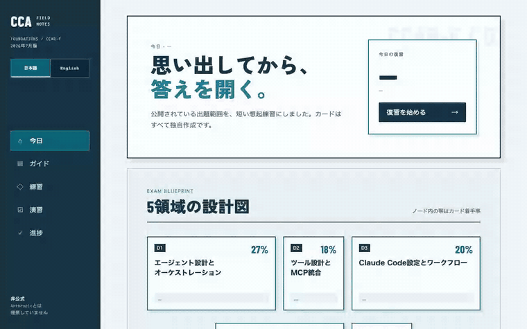
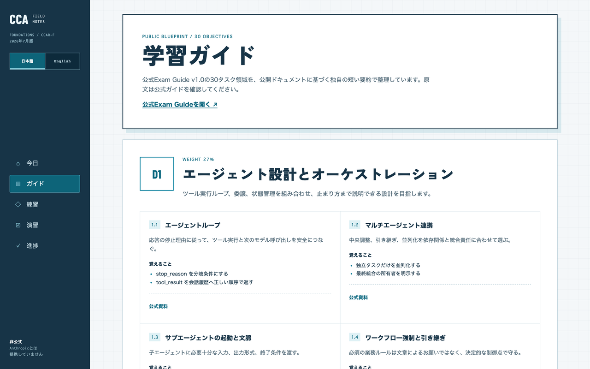
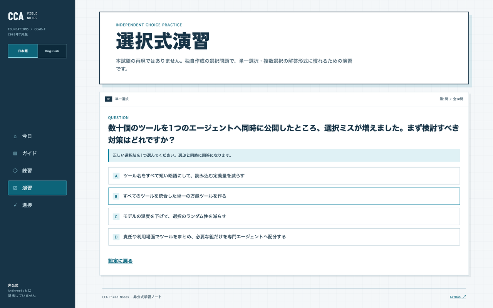
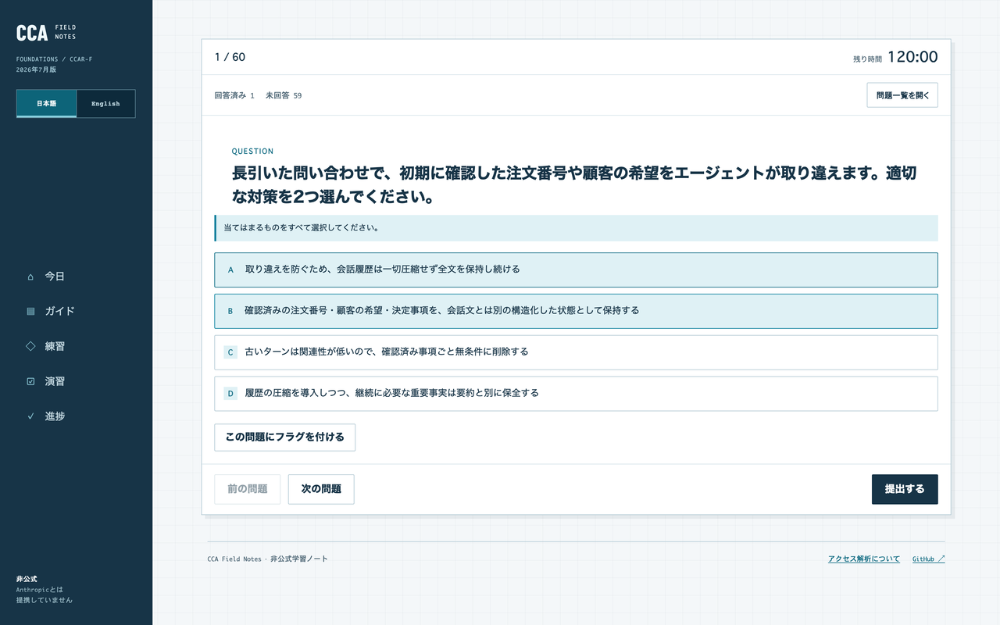
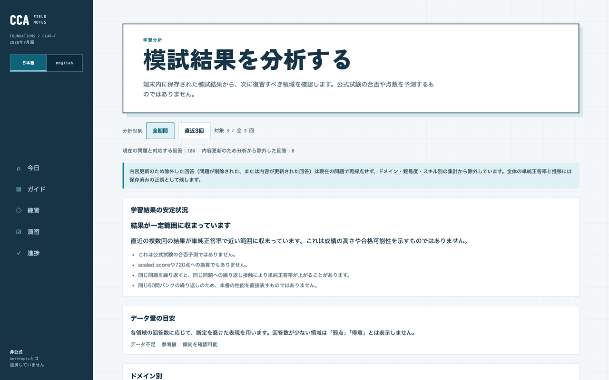

# CCA Field Notes

[English](README.md) | **日本語**

Claude Certified Architect – Foundations（CCAR-F）の公開出題範囲を、日本語の独自要約と想起カードで学ぶ非公式Webアプリです。

[](https://cca.toshi0607.com)

## 動く様子

集中レビューセッション —「**思い出す → 開示 → 評価**」をブラウザ内だけで（Space/Enterで開示、1/2/3で評価）:



| Study Guide（5領域・30タスク） | 選択式・シナリオ演習 |
| --- | --- |
|  |  |
| **60問 Mock Exam** | **学習分析** |
|  |  |

[**すぐ試す → cca.toshi0607.com**](https://cca.toshi0607.com) — 登録不要・進捗はブラウザ内に保存。

## 方針

- Anthropic非公式・非提携
- 2026年7月の公式Exam Guide v1.0にある5領域・30タスクを独自に短く要約
- 練習カードは公開中の公式プロダクトDocsから独自作成
- 実試験問題、記憶から再構成した問題、非公開教材、公式サンプル問題は掲載しない
- 想起カードに加え、独自作成問題による選択式演習（単一選択・複数選択、即時フィードバックと領域別サマリ付き）を収録。本試験の再現ではない
- 選択式演習にはシナリオ演習モードを収録。架空企業のケース記述を読んでから紐づく設問群に答える形式に慣れるための独自教材で、本試験のシナリオの複製・再現ではない
- 練習ビューには一覧表示に加えて集中レビューセッションを収録。フィルタ結果を1枚ずつ「思い出す→開示→評価」で回し、キーボードショートカット（Space/Enterで開示、1/2/3で評価、Escで中断）にも対応
- 進捗はブラウザのlocalStorageだけに保存（JSONの書き出し・読み込みで端末・ブラウザ間の移行が可能）
- Google Analyticsは設定時に通常読み込みし、ページ閲覧以外の学習データを独自イベントとして送信しない

## 機能

現在このサービスで利用できる機能です。すべてブラウザ内だけで完結し、サーバー・ログイン・課金はありません。

- **Study Guide** — 5領域・30タスクの独自要約。セクション単位で着手・完了・再確認の進捗を記録
- **Hands-on guides** — 自分の環境で試す手順つきガイド。ステップ単位のチェックと進捗記録
- **Official scenario mapping** — 公式シナリオを起点に、関連する Study Guide・カード・設問・ハンズオンへ橋渡し
- **Practice cards** — 想起カード。一覧表示と集中レビューセッション（Space/Enterで開示、1/2/3で評価、Escで中断）
- **Choice quiz** — 単一選択・複数選択の選択式演習。即時フィードバックと領域別サマリ
- **Scenario quiz** — 架空企業のケースを読んでから紐づく設問群に答えるシナリオ演習
- **60問・120分の Mock Exam** — 本番規模の通し模試
  - **resume** — 中断しても保存済みセッションから再開
  - **history** — 端末内に保存した過去の模試結果の一覧
  - **result review** — 結果画面から設問ごとの復習
  - **per-choice rationale** — 選択肢ごとの解説
- **Learning analysis** — 模試結果から次に復習すべき領域を提示（公式点数・合否・準備完了度は算出しない）
  - **evidence level** — 分析の根拠となる回答数の十分さを表示
  - **stale attempt safety** — 問題内容が更新された回答は再採点せず、軸別集計から除外
- **local-only storage** — 進捗はこのブラウザのlocalStorageだけに保存
- **JSON export/import** — 進捗の書き出し・読み込みで端末・ブラウザ間を移行

## 推奨学習順序

このサービス独自の学習上の提案です。公式の推奨順序ではなく、合格や準備完了を示すものでもありません。特定の試験日や期間は前提にせず、自分のペースで繰り返してください。

1. 学習開始地点を選ぶ（ガイドの「学習開始地点を選ぶ」）
2. Study Guide で基礎を確認する
3. Hands-on で実際に試す
4. Practice カードで想起する
5. Quiz と公式シナリオで判断を練習する
6. 60問の模試を受ける
7. 結果・復習・学習分析で誤答を確認する
8. 復習優先候補に戻って繰り返す

## 開発

```sh
pnpm install
pnpm assets:generate
pnpm dev
pnpm test
pnpm test:e2e
pnpm build
```

Astroの静的ビルドを使用します。サーバー、APIキー、データベースは不要です。

### E2Eテスト（Playwright）

`tests/`は機能別のspecに分割し、共通処理は`tests/fixtures/`（クリーンなstorageで1 navigation開始・共有UIヘルパー・axe/storageヘルパー）に集約しています。純粋ロジックの網羅検証はVitest（`pnpm test`）、ブラウザ統合・focus・storage・routing・遅延chunk・download・アクセシビリティ・レスポンシブはE2Eが担当します。

```sh
pnpm test:e2e          # 完全回帰（毎回production buildを作成）。マージゲート
pnpm test:e2e:fast     # 開発中の反復用。@slow（axe・レスポンシブ・重いシナリオ）を除外
pnpm test:e2e:a11y     # アクセシビリティ(axe)のみ
pnpm test:e2e:ui       # Playwright UIモード
```

`test:e2e:fast`は起動済みサーバーを再利用する前提の速いフィードバック用です（下記手順でサーバーを起動しておくと、ビルドを省いて数十秒で完了します）。サーバー未起動なら自動でビルドするため、その初回はゲート同等の時間がかかります。

`pnpm test:e2e`は毎回productionビルドを作り直すため、開発中に繰り返すと待ち時間が長くなります。ローカルでプレビューサーバーを起動済みなら、明示的に再利用できます（古いビルドを誤って使わないよう、既定では再利用しません）。

```sh
# 別ターミナルで起動（analyticsテストが測定IDを要求するため、webServerと同じIDでビルド）
PUBLIC_GA_MEASUREMENT_ID=G-TEST123456 pnpm build && pnpm preview --host 127.0.0.1 --port 4325
pnpm test:e2e:reuse   # または test:e2e:fast。起動済みサーバーへ実行
```

`test:e2e:fast`は開発中のフィードバック用で、マージ前には必ず`pnpm test:e2e`（full）を通してください。ワーカー数は`PW_WORKERS`で上書きできます（既定2）。

### Webフォント

見出し用フォント（Barlow Condensed / Zen Kaku Gothic New）は、使用文字だけにサブセットしたwoff2を`public/fonts/`にコミットしてセルフホストしています。見出しやUI文言を変更してサブセットに文字が足りなくなると`pnpm test`が失敗するので、その場合は次で再生成してください。

```sh
pnpm build
pnpm fonts:subset
```

ファイル名には内容ハッシュが含まれ、参照は`public/fonts/manifest.json`経由で自動追従します。生成物のwoff2とmanifestはコミットしてください。

## Google Analytics

GA4のWebデータストリームに表示される測定IDを、Production環境のみに設定します。未設定ならGoogleタグとアクセス解析の表示は出力されません。不正な形式はビルドエラーになります。

```sh
vercel env add PUBLIC_GA_MEASUREMENT_ID production
vercel deploy --prod
```

値は`G-...`形式です。設定時は`gtag.js`を通常読み込みし、広告ストレージ・広告向けユーザーデータ・広告パーソナライズを拒否した状態で基本ページビューを設定します。Google Signalsと広告パーソナライズ用シグナルも無効で、GA Cookieはアクセス中のホストだけに限定します。アプリ独自のカスタムイベントは実装していません。ページビューだけに限定する場合は、GA4 Webデータストリーム側でも「拡張計測」を無効にしてください。利用者向け説明は`/privacy/`に掲載します。

## 告知動画

`video/`はSNS告知動画（約34秒・1920×1080・H.264）を生成する独立したRemotionプロジェクトです。自前の`package.json`を持ち、アプリ本体のビルド・テスト・デプロイには影響しません。`video-hf/`は同じコンポジションを`remotion-to-hyperframes`スキルで[HyperFrames](https://hyperframes.heygen.com/)（HTML + GSAP）へ移植したものです（`video-hf/TRANSLATION_NOTES.md`参照）。画面素材は`video/assets/`に置いた実画面スクリーンショットです。

```sh
# Remotion
cd video && pnpm install && npx remotion render promo out/promo.mp4
# HyperFrames（PATH上に system ffmpeg が必要）
cd video-hf && npx hyperframes render --quality high --output out/promo.mp4
```

`out/`の生成物はコミットせず、完成した動画はGitHub Release（[promo-video-v2](https://github.com/toshi0607/cca-study-guide/releases/tag/promo-video-v2)）で配布します。

## 公式情報

- [Certification page](https://anthropic-partners.skilljar.com/claude-certified-architect-foundations-certification)
- [Exam Guide v1.0](https://everpath-course-content.s3-accelerate.amazonaws.com/instructor%2F6nizmqk8tpzpfjvt6qmmav7rh%2Fpublic%2F1783542750%2FClaude+Certified+Architect+%E2%80%93+Foundations+Exam+Guide.pdf)

最終確認: 2026-07-14

## License

Source code is released under the MIT License. Study content is independently authored; Anthropic product and certification names remain the property of their respective owners.
